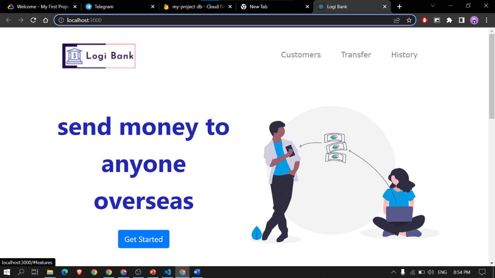
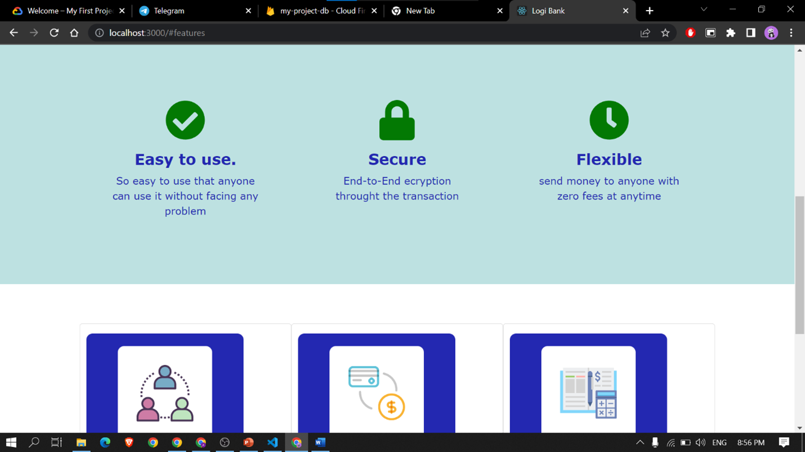
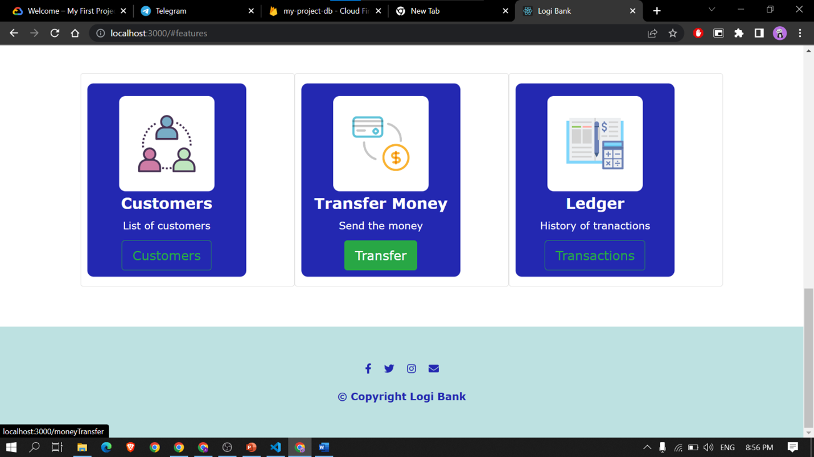
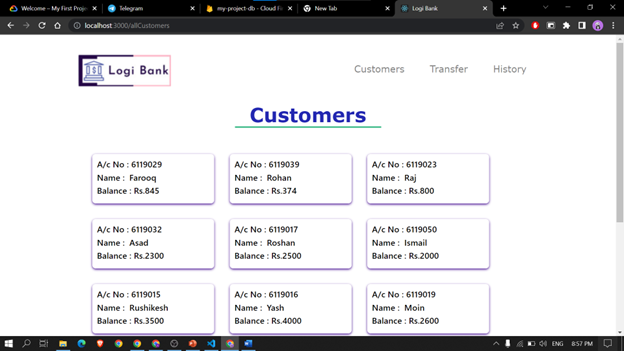
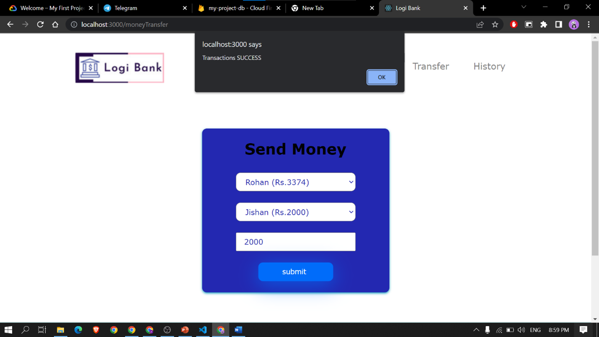
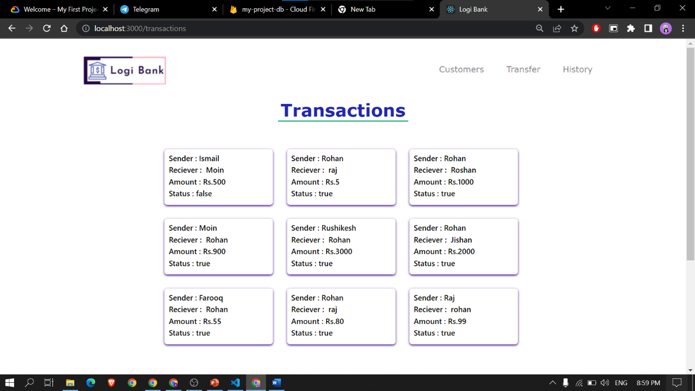

# Basic-Banking-System-

## Introduction
>  
> A responsive web application used to transfer money between multiple users.

## Tech Stack for Project:
>  ### Front-End:
- ReactJs
- Bootstrap
>  ### Back-End:
-  JavaScript 
-  Firebase (Firestore database)

### Screenshots of the website

### Created by
[Rohan Shirke](https://github.com/rohanshirke00)
Email : rohanshirke2k@gmail.com

### COPYRIGHT

Copyright 2023-24 © Logical Group Inc.
All rights reserved.